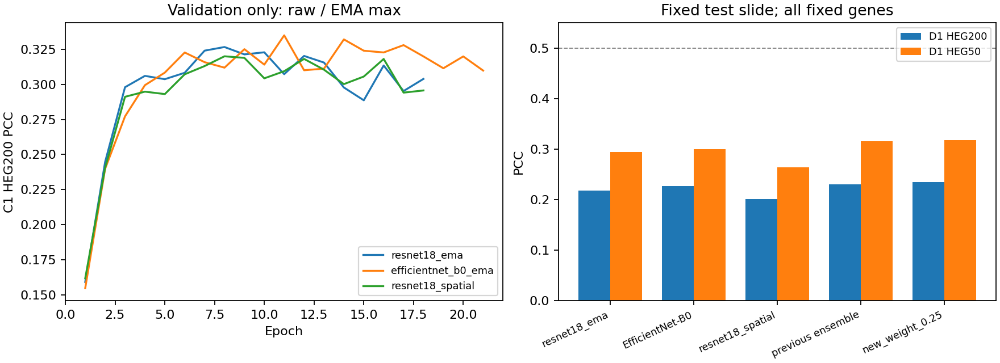

# 本轮优化与仓库整理（2026-09-14）

本轮按 C1 选择 **new_weight_0.25**，在固定 D1 上 PCC 为 **0.2343 / 0.3180（HEG200 / HEG50）**。相对上一轮 C1 选定集成，HEG200 变化 **+0.0042**，HEG50 变化 **+0.0024**。固定面板平均仍未达到 0.5，不能以验证集、测试后挑选基因或平滑真值替代。

**增益幅度有限。** 24 个空间块、300 次配对 bootstrap 的增益 95% 区间：HEG200 [0.0009, 0.0077]；HEG50 [-0.0037, 0.0091]，后者跨过零。该区间仅描述本张切片，不能代表独立患者或消除反复开发的偏倚。MAE 从 0.4256 增至 0.4274，误差指标略有变差。三组新权重重新加载推理后与保存预测逐元素一致。见 [核验与区间](../benchmarks/liver/optimization_verification.json)。

## 本次实际完成的对照

保持 A1+B1 / C1 / D1、固定高表达基因面板和未重建真值。三组方案均从 ImageNet 初始化，在训练集端到端训练：ResNet18、EfficientNet-B0，以及训练标签 20% 邻域平滑的 ResNet18。共同使用 warmup + 余弦学习率、EMA、颜色增强。每组在 C1 选原权重/EMA和单次/四旋转推理；再选单模型、三模型均值及预先声明的旧集成混合比例。

这是三组训练方案的比较；共同改变了多个训练因素，不能把差异单独归因于 EMA。`spatial` 与 `resnet18_ema` 只差训练标签平滑，可以直接作该因素的对照。

本轮三组最终均选中了原权重，EMA 没有被选中。新单模型均未超过上一轮集成。训练标签平滑使 D1 HEG200 从 0.2182 降到 0.2010，HEG50 从 0.2947 降到 0.2635，当前证据不支持继续加大平滑强度。最终小幅增益来自新旧预测组合，而非单个模型的明显突破。

| 候选 | C1 HEG200 | C1 HEG50 | D1 HEG200 | D1 HEG50 | D1 MAE |
|---|---:|---:|---:|---:|---:|
| resnet18_ema | 0.3303 | 0.4602 | 0.2182 | 0.2947 | 0.4446 |
| efficientnet_b0_ema | 0.3439 | 0.4779 | 0.2274 | 0.2998 | 0.4324 |
| resnet18_spatial | 0.3200 | 0.4410 | 0.2010 | 0.2635 | 0.4432 |
| new_equal_ensemble | 0.3481 | 0.4799 | 0.2264 | 0.2987 | 0.4369 |
| previous_contextfusion | 0.3626 | 0.5008 | 0.2302 | 0.3156 | 0.4256 |
| new_weight_0.25 **← C1选择** | 0.3665 | 0.5052 | 0.2343 | 0.3180 | 0.4274 |
| new_weight_0.5 | 0.3641 | 0.5016 | 0.2342 | 0.3147 | 0.4299 |
| new_weight_0.75 | 0.3574 | 0.4925 | 0.2311 | 0.3077 | 0.4331 |

模型行名含 `ema` 表示训练过程中维护 EMA，并不表示最终一定选择 EMA；各组最终权重类型、轮次、TTA 与耗时见 [训练记录](../benchmarks/liver/optimization_fits.json)。混合候选中 `new_weight` 是 C1 最优新候选的权重，其余为上一轮集成；最优新候选是 `new_equal_ensemble`。

## 为什么仍有差距

1. 历史错误已经修复：当前面板确实是训练集高表达基因；新模型训练与计分使用相同面板归一化，测试真值没有重建。本轮从源 counts 重建四张切片，五类数组字段与原数据逐元素一致；144 个跨切片、跨尺度裁图抽查完全一致。
2. 前轮模型 HEG50 从训练 0.608 降到 C1 0.485、D1 0.302，存在明显泛化差距。更多训练轮数与更复杂编码器是否有用，要看上表，不能只看训练损失。原 ST-Net 的 D1 为 0.1472 / 0.1978，前轮改进已证明能学习部分形态相关信号，但不能推导固定面板应达到 0.5。
3. C1 与 D1 的捕获 UMI 中位数为 12423 与 6010。前轮固定预测、只对 C1 做计数降采样时，HEG200 从 0.3485 降至约 0.3033。这支持计数差异有贡献，但不能解释全部差距，也不是性能硬上限。高平均表达不保证强空间变化。
4. 单供体仅两张训练切片，且 D1 已在多轮研究中被查看；这是反复使用的开发基准，仍需新的独立供体做最终外部测试。ResSAT 鼠脑与重建目标的论文数值不能直接作为这个任务的应达阈值。

## 可复查产物

- [全部候选指标](../benchmarks/liver/optimization_20260914.csv) · [全部逐基因 PCC](../benchmarks/liver/optimization_per_gene.csv) · [此前七基线及消融](../benchmarks/liver/baseline_20260913.csv)。
- [训练前方案](../benchmarks/liver/optimization_plan.json) · [C1 选择记录](../benchmarks/liver/optimization_selection_locked.json)。选择记录先于本批 D1 RNA 评价写入，但不代表 D1 在项目历史中从未被查看。
- 本地 `results/optimization_20260914/` 保留权重、完整历史、各候选预测和检查记录；`prediction_only.npz` 与 `predicted_log_expression.csv.gz` 是不含实测 RNA 的最终表达预测。
- 仓库入口已统一为 `run.py`，核心代码放在 `src/he2st/`，参数放在 `configs/`。原始数据、权重和完整论文不进入 Git；正式报告及精选最终 PPT 已纳入，历史编号脚本保留索引和原复现路径。

详细前轮诊断与论文口径核对见 [06 报告](06_LIVER_CONTEXT_IMPROVEMENT.md) 和 [05 报告](05_PCC_DIAGNOSIS.md)。运行方式见 [快速开始](QUICKSTART.md)。

## 2026-09-15 图文修订与补充对照

正式报告由 3 幅图扩充为 17 幅，补齐五种原方法、自建 ContextFusion、六模型集成及数据/结果分析图，并注明原方法图与本地适配的区别。GSE240429 的原始生物学研究（Andrews 等，2024）和 BLEEP 预测方法分别引用，同数据来源论文不与本项目跨协议排名。

新增预测空间平滑实验提前固定近邻数 6/12/24 和混合权重 0.25/0.5/0.75/1，加上原输出共 13 个候选。只以 C1 HEG200 选择，所有非零平滑候选均不及原输出，最佳非零候选为 k=6、alpha=0.25，C1 为 0.3580，低于原来的 0.3665。选择保持原输出，D1 仍为 0.2343/0.3180。未在 D1 上搜索平滑参数，也未平滑真值。[计划和完整记录](../benchmarks/liver/report_spatial_ablation/)。

固定面板训练检出率最低 94.20%、中位数 98.48%。最终集成相对原集成有 151 个基因的 PCC 上升、49 个下降；HEG200 中只有 1 个基因 PCC > 0.5，HEG50 中为 0 个。上述计数为结果锁定后的诊断，不用于挑选新面板。[数值来源](../benchmarks/liver/report_figure_diagnostics.json)。
